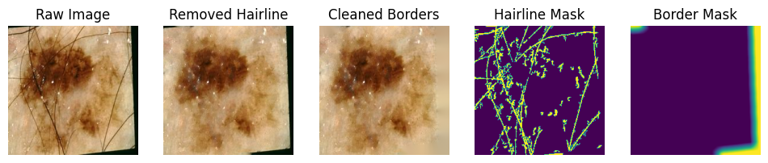
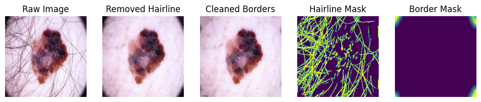
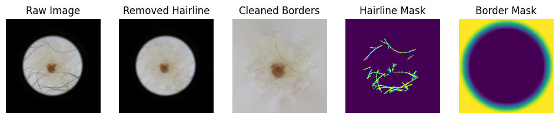
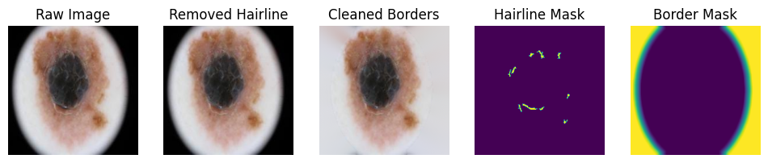
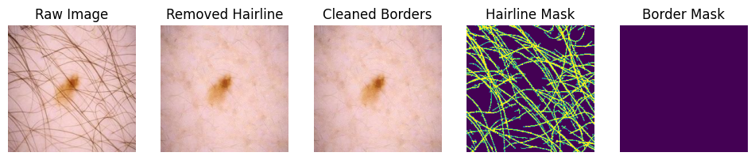
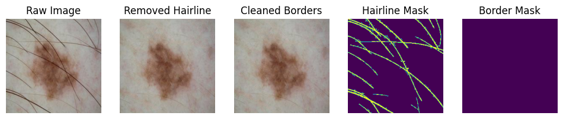
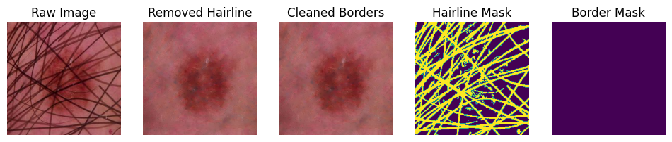
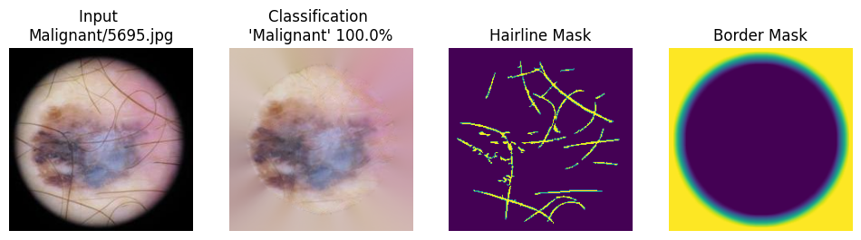
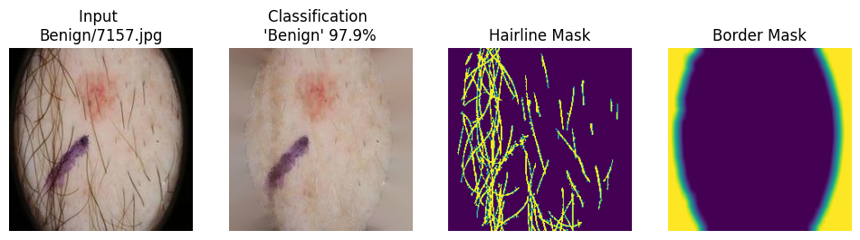

# Skin Cancer Classification
To classify skin cancer images as benign or malignant

## Dataset
The raw dataset is provided under raw_dataset/ to be used as the main data source. 

### Dataset directory structure

```
raw_dataset/
|___ test/
|    |___ Benign/
|    |    |___ 6299.jpg
|    |    |___ 6300.jpg
|    |    |___ ...
|    |___ Malignant/
|         |___ 5602.jpg
|         |___ 5603.jpg
|         |___ ...
|
|___ train/
|    |___ Benign/
|    |    |___ 1.jpg
|    |    |___ 2.jpg
|    |    |___ ...
|    |___ Malignant/
|         |___ 1.jpg
|         |___ 2.jpg
|         |___ ...
```

## Model
The model used in here is YOLOv8 (small) classification model

## Directory Structure
Place all the files in same directory as the following:
```
├─── raw_dataset/   raw data source
├─── utils/         contains helper functions and classes
├─── demo-classification.ipynb  jupyter notebook demonstrate the classification 
├─── demo-preprocessing.ipynb  jupyter notebook run the preprocessing demo 
├─── classifier.py      contains SkinCancerClassifier class 
└─── clean_dataset.py  command line tool to create clean dataset for training
```

## Installation

### Clone
```
git clone https://github.com/mshenoda/skin-cancer-classification.git
```

### Create environment 
```
cd diffugen
conda create -n skin python=3.12
conda activate skin
```

### Install requirements

### PyTorch with CUDA Dependency
```
pip install torch==2.3.1 torchvision==0.18.1 --index-url https://download.pytorch.org/whl/cu121
```
### Other packages
```
pip install -r requirements.txt
```


### Usage
#### Runing demo
Recommended to use VSCode for running demo notebooks
- preprocessing techniques:
    - run demo-preprocessing.ipynb
- classification / postprocessing evaluation:
    - run demo-preprocessing.ipynb

#### Data cleaning 

```shell
python clean_dataset.py raw_dataset clean_dataset
```

#### Training
```shell
cd models\yolov8s-cls
python train.py
```
Training results are under models\yolov8s-cls\runs\classify\


#### Examples - Data Cleaning:








#### Examples - Predictino



## Citation
If you find this useful for your research, please cite:
```
@inproceedings{diffugen,
  title     = {Skin Cancer Classification},
  author    = {Shenoda, Michael}
  year      = {2024}
}
```